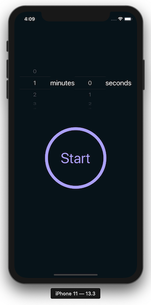
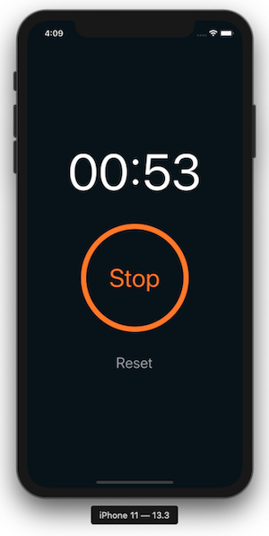
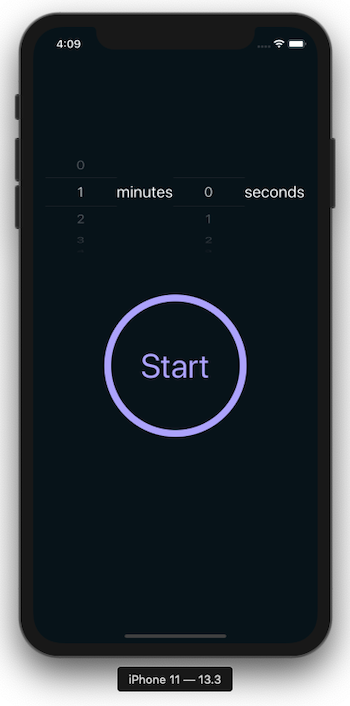
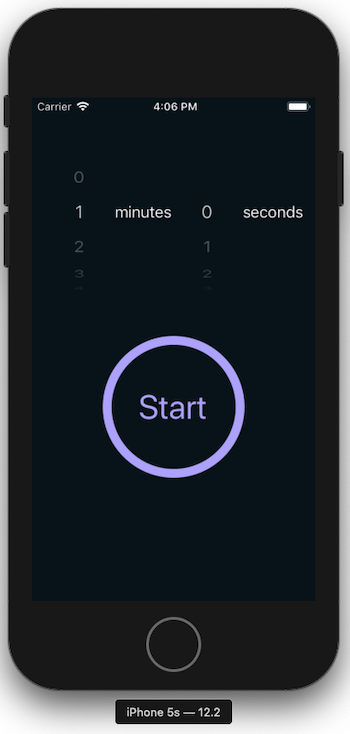
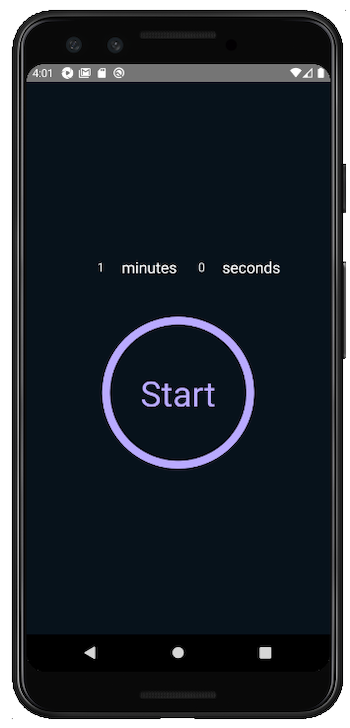

# ⏰ React Native Timer App ⏰

## Project Description

It's a cross-platform timer app built with TypeScript.
Features platform-specific styling, and visual, auditory, and physical (vibration) alerts on time up.

|  |  |
| :---------------------------------------: | :--------------------------------: |
|               _Time Picker_               |         _Countdown Timer_          |

## Installation

Please set up a [React Native development environment](https://reactnative.dev/docs/environment-setup) if you have not already done so.

### Running iOS on a Mac via a simulator

If you wish to install using [Bundler](https://bundler.io/), please see the advanced iOS install instructions at the end of this README. Otherwise, make sure you have a version of CocoaPods installed, and run the following commands:

```
npm i
cd ios
pod install
cd ..
npx react-native run-ios
```

### Running Android on a Mac or PC

Attach a device or run an emulator and run the following commands:

```
npm i
npx react-native run-android
```

## Screenshots

|  |  |  |
| :---------------------------------------------: | :---------------------------------------------: | :-----------------------------------------------------------: |
|                   _iPhone 11_                   |                   _iPhone 5s_                   |                      _Android Nexus 5X_                       |

### (Bonus) Advanced iOS Development Instructions (using Bundler)

#### 1. Install Ruby

This project requires Ruby 2.7.0. It can be installed with `rbenv`:

`brew install rbenv`

Then run `rbenv init` and follow the instructions to finish installation.

To install 2.7.0: `rbenv install 2.7.0`

To use 2.7.0: `rbenv local 2.7.0` or `rbenv global 2.7.0` (to override global version), followed by `rbenv rehash`

#### 2. Install Packager

`gem install bundler`

#### 4. Install CocoaPods

`bundle install`

#### 5. Install Pods

```
cd ios
npm run podInstall
cd ..
```

#### 6. Run Project

`npx react-native run-ios`
